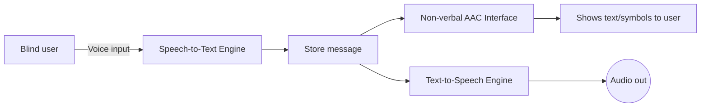
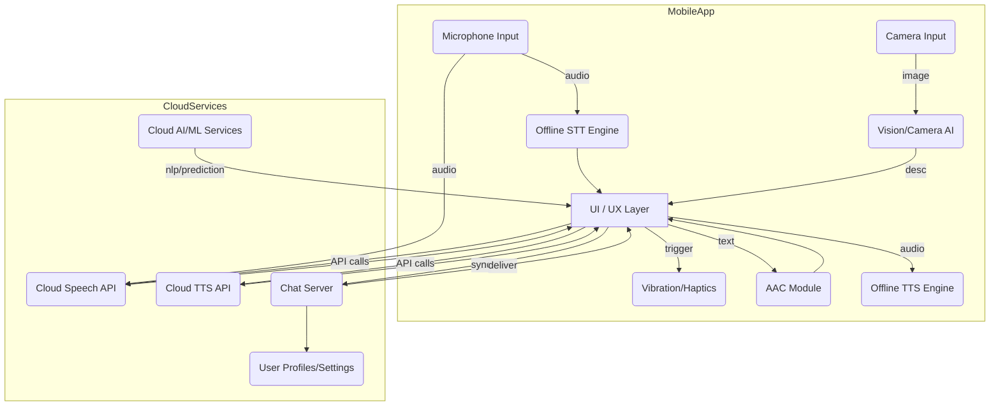

# Inclusive Communication App Design

## Executive Summary

This report analyzes how to build a mobile app enabling seamless, multimodal communication among blind users, non-verbal users, and sighted users. We first outline each group’s needs and key accessibility standards (e.g. WCAG 2.2, ISO 9241-171, ISO/IEC TS 20071-41)【26†L152-L160】【34†L109-L118】. We propose at least eight detailed use cases (see table below), covering scenarios like group conversations and emergency alerts, each with personas, goals, success metrics, edge cases (e.g. noisy environments or device failures) and privacy/safety considerations (e.g. encrypt voice/text data, consent for sharing camera images). Next, we describe interaction flows and UI/UX patterns: for example, blind users rely on voice I/O and haptics, non-verbal users rely on symbol boards, text input, or eye-tracking, and sighted users use standard visuals and audio. We discuss how to adapt each modality (speech-to-text, text-to-speech, image-to-audio, symbol selection, etc.) to user ability, citing examples like Google’s LookToSpeak eye-gaze system【15†L28-L30】 and symbol-based AAC apps (e.g. Proloquo2Go)【24†L183-L187】.

We evaluate technical architectures: on-device vs cloud tradeoffs (privacy vs power), real-time STT/TTS and translation APIs, latency targets, offline mode support, and integration of sensors/wearables (e.g. Bluetooth Braille display, haptic bands)【10†L133-L142】【31†L90-L99】. Privacy and regulations are addressed by design: all communications should be encrypted, user consent managed (especially for recording or camera use), and the app should follow GDPR/ADA/MDR guidelines where applicable. Evaluation metrics include task success rate, STT accuracy, user satisfaction (usability/accessibility testing, A/B UX tests, field trials with target users)【10†L189-L197】【46†L113-L119】. We suggest a deployment plan (cross-platform mobile, CI/CD, community support) and a rough cost/resource comparison. Finally, a table contrasts **basic**, **advanced**, and **premium** implementations (features, pros/cons).

For impact presentations, we recommend focusing on metrics (communication speed gains, satisfaction), storytelling with personas, and live demos (e.g. simulating a blind/non-verbal conversation). Visually rich slides (flow diagrams, usage screenshots, empathy quotes) and a clear outline (problem, solution, demo, results) will engage audiences. We assume moderate budget and cross-platform rollout in 6–12 months (adjust as needed).

## User Needs & Accessibility Requirements

- **Blind users:** Cannot rely on vision. The app must provide **audio and haptic interfaces** (via screen readers, synthesized speech, vibration) instead of visual cues. They need **high-contrast, large-touch targets**, rich **speech output**, and support for **Braille displays**. For instance, refreshable Braille or vibrotactile feedback can convey messages or navigation cues【46†L113-L119】. Camera-based **image-to-audio** or OCR can describe text/objects (e.g. TapTapSee【38†L517-L523】). Since blind users may also speak, **speech-to-text** (STT) lets them input by voice, which can be translated for others. Consistent labeling and compatibility with mobile screen readers (VoiceOver/TalkBack) and WCAG-compliant controls (perceivable, operable, robust) are essential【31†L90-L99】【28†L189-L193】.

- **Non-verbal users:** Cannot speak, so they need **alternative output modes**. This includes **symbol boards or icon grids** (AAC interfaces), text keyboards, or typing-by-gesture. Our app should support **predictive text and next-word suggestions** (like the Spoken AAC app’s AI prediction)【39†L31-L40】 to speed communication. Input can come via touch (icon taps), eye-tracking (LookToSpeak【15†L28-L30】), or switches for scanning. Outputs should include **text display** and **text-to-speech (TTS)** so others hear their message. Customizable vocabularies and multiple language voices (as in Proloquo2Go【24†L183-L187】) help users with varied literacy. ISO/IEC TS 20071-41 provides guidelines for pictogram design in AAC【26†L152-L160】, so symbols must be clear and culturally appropriate. The interface must also handle limited motor control: for example, large buttons, switch-accessibility, and simple layouts.

- **Sighted users:** Can use normal voice and visual UIs. For conversations, they may speak or type. They benefit from seeing transcripts of what blind or non-verbal users “say” (for transparency) and possibly helping select words (as partners do in co-construction【10†L169-L178】). The UI should also allow them to **trigger non-visual outputs** (audio or haptics) for others (for example, a “read aloud” button for messages). Standard accessibility (captions, clear contrast) still apply, and optionally speech recognition for hands-free use.

In all cases, the app should apply **WCAG 2.2 / ISO 40500** guidelines for perceivable and operable interfaces【28†L189-L193】【31†L90-L99】 and **ISO 9241-171:2025** for general software accessibility【34†L109-L118】. This includes compatibility with assistive technologies (screen readers, Braille, switches), customizable UI settings (text size, color), and voice alternatives for non-visual content.

## Use Cases & Personas

The table below outlines eight representative scenarios, each with a persona, context, goals, success criteria, edge conditions, and privacy/safety concerns. These use cases illustrate diverse interactions between blind (B), non-verbal (N), and sighted (S) users.

| Persona & Context                                                                                                                     | Goals & Success Criteria                                                                                                                                               | Edge Cases & Privacy/Safety                                                                                                                                                                                                            |
| ------------------------------------------------------------------------------------------------------------------------------------- | ---------------------------------------------------------------------------------------------------------------------------------------------------------------------- | -------------------------------------------------------------------------------------------------------------------------------------------------------------------------------------------------------------------------------------- |
| **Alice (Blind student)** – group study with peers (one sighted, one nonverbal). She needs to follow and contribute to discussion.    | _Goal:_ Ask/answer questions using voice; follow slides via audio. _Success:_ Her comments are correctly transcribed for others, she hears others clearly.             | _Edge:_ Background noise or poor mic could garble STT; voice recognition errors (e.g. homophones). _Privacy/Safety:_ Encrypt voice and transcript data; warn if recording ambient conversation.                                        |
| **Ben (Non-verbal autistic teen)** – class Q&A with teacher (sighted). Uses app to “speak”.                                           | _Goal:_ Select phrases/words on symbol board quickly to participate. _Success:_ He can ask and answer with minimal delay, peers understand him.                        | _Edge:_ Slow response if prediction fails; if eye-tracking is used, fatigue or misclicks. _Privacy:_ Ensure only text (not sensitive images) are shown; prevent bystanders from reading his screen.                                    |
| **Carla (Sighted doctor)** and **David (Non-verbal stroke patient)**. In tele-consult, Carla asks questions, David answers via app.   | _Goal:_ Conduct medical history interview. _Success:_ David conveys symptoms clearly through TTS; Carla sees text backup and transcripts.                              | _Edge:_ Medical terms mistranscribed; patient struggles with selection interface. _Privacy:_ App must use HIPAA/GDPR-safe cloud or local processing for medical info; patient consents to audio recording.                             |
| **Ethan (Blind hiker)** meets a group (one sighted guide, one non-verbal friend). Uses app for coordination.                          | _Goal:_ Identify landmarks (via image description) and communicate route plans. _Success:_ Audio descriptions from camera are timely, messages relay clearly to group. | _Edge:_ In bright sun, camera glare affects vision input; offline scenario (no cell service) means use on-device AI for critical info. _Privacy:_ Location data is sensitive – user opts in to share only route info, not precise GPS. |
| **Fatima (Non-verbal child with cerebral palsy)** – lunch ordering with cashier (sighted).                                            | _Goal:_ Order meal items using pictures/text. _Success:_ Cassay sees clear order; Fatima confirms via audio “done”.                                                    | _Edge:_ Noisy cafeteria interferes with TTS speaker; cashier unfamiliar with interface. _Privacy:_ Transaction is public – ensure no private health info (e.g. allergies) is accidentally displayed.                                   |
| **George (Sighted colleague)** calls on speakerphone; **Helen (Blind)** participates remotely.                                        | _Goal:_ Share meeting notes. _Success:_ Speech from others is auto-transcribed, Helen hears via TTS; Helen’s spoken comments auto-transcribed for all.                 | _Edge:_ Voice delay causes overlapping talk; AI mis-senses who is speaking. _Privacy:_ Use end-to-end encrypted conference channel; control who sees transcripts.                                                                      |
| **Isabella (Non-verbal stroke survivor)** – at home video call with **Jack (Sighted friend)**.                                        | _Goal:_ Express feelings and daily news. _Success:_ App’s prediction engine helps form sentences; Jack hears her via TTS and sees typed text with images.              | _Edge:_ Emotional words (like frustration) may be hard to predict; fatigue over long use. _Privacy:_ The call should not record sensitive info or video feed without permission.                                                       |
| **Ken (Blind)** and **Liam (Non-verbal)** – visit museum with **Mia (Sighted guide)**. Use app to ask guide questions about exhibits. | _Goal:_ Describe art via camera-to-audio, ask questions by voice/text. _Success:_ Guide’s answers are read aloud to Ken and shown to Liam; they send back thanks.      | _Edge:_ Museum Wi-Fi may be weak – app should fallback to offline captions. _Privacy:_ Don’t store images taken; only transient analysis to speech.                                                                                    |

Each use case addresses different contexts (education, healthcare, daily life) and highlights how the app must adapt. For example, in noisy or offline scenarios we rely on **on-device models** for STT/TTS. Privacy controls (consent pop-ups, encryption) ensure sensitive user data (health info, audio, location) is protected.

## Interaction Flows & UI/UX Patterns

We design _multimodal communication flows_ so that each group can seamlessly exchange messages:

- **Voice ↔ Text (B⇆N/S):** A blind or sighted user speaks into the app; **speech-to-text (STT)** converts it to text. If the target is blind, **text-to-speech (TTS)** speaks the message aloud (and optionally Braille on a connected display)【10†L133-L142】【46†L113-L119】. If the target is non-verbal, the text appears on their symbol board or text chat. In reverse, a non-verbal user taps symbols or types text, which is either spoken via TTS for the blind user or shown as text captions for the sighted. (Mermaid flow: user speaks → STT → messaging → TTS output).

- **Image-to-Audio (B→others):** The blind user can use the camera to capture images (e.g. a menu or sign). An _image recognition/OCR module_ on-device or in cloud converts this to descriptive text, then TTS outputs to all participants【38†L517-L523】. The UI offers a simple “Describe” button.

- **Gestures & Haptics:** For accessibility, large buttons and swipe gestures navigate the app. Haptic feedback confirms actions (e.g. vibration when a message is sent or received)【46†L113-L119】. The app may use distinct vibration patterns for different notifications (urgent message, error) since studies show “mapping distinct haptic patterns…can improve sensemaking” for blind users【46†L155-L160】.

- **Symbol Boards & Eye-Tracking (N):** Non-verbal users see a grid of pictograms or text shortcuts (styled per ISO TS 20071-41【26†L152-L160】). They tap icons or use dwell/eye gestures (like Google LookToSpeak’s gaze selection【15†L28-L30】) to form messages. The interface provides word prediction (as in Spoken AAC【39†L31-L40】) to speed up typing. On success, the chosen text is sent to others as speech/audio or captions.

- **Adaptation per Ability:** The UI automatically adapts: blind users get an auditory/haptic mode (screen reader hints, voice prompts for all controls). Non-verbal users get a visual symbol-heavy interface (or scanning mode if low vision). Sighted users see standard chat bubbles. Users can toggle “Hearing Impaired” or “Vision Impaired” modes in settings. For example, enabling a _“Low Vision”_ mode increases font and spacing; enabling _“Speech Output”_ mode means every received text is auto-read aloud.

**Flowchart Example (Blind↔Non-verbal):** Below is a simplified flow of how a message might travel from a blind user to a non-verbal user via the app:

In this flow, the blind user speaks; the app converts speech to text, stores it, then both displays it on the non-verbal user’s AAC board **and** speaks it via TTS.

**UI/UX Patterns:** Key design patterns include:

- **Shared Chat View:** All participants see a unified chat stream. Each message shows both text and an optional icon for voice/speaker. Blind users can swipe through messages with one finger (VoiceOver convention). Non-verbal users have larger tap targets.
- **Clear Prompts:** For input, the app prompts “Tap icon or say a word”. There are quick-access phrase buttons (e.g. “Yes/No”, “Thank you”) especially for non-verbal or novice users.
- **Error Handling:** If STT fails, the app vibrates and shows “Sorry, try again.” If a gesture is unrecognized, a hint appears.
- **Privacy Modes:** A “private mode” hides message previews until tapped (protecting sensitive content). Camera/microphone access shows an always-on indicator and requires permission.

All interfaces must conform to **WCAG 2.x/ISO standards**, ensuring text alternatives for audio, support for assistive tech, and robust input controls【31†L90-L99】【34†L109-L118】.

## Technical Architecture Options

We consider several architecture variants and technologies:

- **On-Device vs. Cloud:**
  - _On-device processing_ (using libraries like TensorFlow Lite) keeps data local – critical for privacy. For example, local STT/TTS (e.g. Android’s offline recognizer or Apple’s on-device voice models) works without internet. It reduces latency (near-instant feedback) and works offline【31†L90-L99】. However, on-device models can be less accurate (limited vocabulary) and consume battery/CPU.
  - _Cloud services_ (e.g. Google Cloud Speech-to-Text, AWS Polly) offer high accuracy and language support. They enable heavy ML (image recognition, translation) without burdening the phone. Drawbacks: network latency (may be ~0.5–1s per API call), potential data charges, and privacy concerns (sending voice/text to servers). A hybrid approach can be best: use on-device for basic chat (voices, TTS) and cloud for advanced tasks (complex translation or scene understanding).

- **Real-time Processing:** The app should stream audio to STT and get back text with minimal delay. For conversational flow, end-to-end latency (capture to output) should be <500ms ideally. Techniques like voice activity detection ensure STT only processes when user speaks. Text is then sent over a messaging protocol (e.g. WebSockets) to recipients immediately.

- **Offline Modes:** If offline, fallback to local speech models and caching. For instance, download language packs (TTS, STT) for offline use. Also, core functionalities like messaging could switch to peer-to-peer (Wi-Fi Direct/Bluetooth) if no internet.

- **APIs & ML Models:** We incorporate:
  - **Speech-to-Text (STT):** e.g. Google Speech API, Mozilla DeepSpeech (on-device), or Microsoft Azure.
  - **Text-to-Speech (TTS):** e.g. built-in iOS/Android TTS voices, or cloud voices (Google Wavenet). We need many languages/voices for personalization【24†L183-L187】.
  - **Vision/Image:** For image description, use ML (Vision API, or on-device TensorFlow).
  - **Natural Language Processing:** For predictive text and translation, possibly use large language model APIs or custom ML (e.g. small RNN for word prediction).
  - **Sign/Gesture Recognition:** Optionally, smartphone camera could try to recognize simple sign language or gestures (e.g. thumb up = “yes”), using ML models.

- **Sensors & Devices:**
  - **Camera:** For image-to-audio (environment or sign detection). Also for possible lip-reading or eye-tracking.
  - **Microphone:** Essential. Must have noise cancellation to work in crowds.
  - **Haptic (vibration):** To notify of incoming messages without sound (important for privacy or when audio is off)【46†L113-L119】.
  - **Wearables:** E.g. **smartwatch** could vibrate for notifications, or allow quick replies (preset messages).
  - **Bluetooth/NFC:**
    - **Braille Display:** Pair via Bluetooth to output text in Braille. For blind users comfortable with braille.
    - **NFC Tags:** Use NFC stickers in environment (e.g. on signs or equipment) that a blind user can tap to get audio info.
  - **AR (Augmented Reality):** If the user wears AR glasses, the app could overlay captions or translate sign language in real-time. (This is a _premium_ feature.)

- **Architecture Diagram:** Below is a conceptual architecture diagram (mermaid syntax) showing the main components:

In practice, the **MobileApp** runs on-device processes (STT, TTS, vision) and communicates with **CloudServices** for heavier tasks (accurate speech recognition, language models, data sync). Messaging goes through a real-time server so users stay in sync.

- **Technical Trade-offs:**
  - **Latency vs Privacy:** Real-time chat favors on-device to minimize lag【31†L90-L99】, but on-device models can be bulky.
  - **Battery/Compute:** AI features drain battery; careful profiling is needed. Might offload to cloud during charging.
  - **Data Usage:** Continuous STT to cloud consumes data; offer settings (e.g. “Use Wi-Fi only”).
  - **Reliability:** Fallback to minimal features if any component fails (e.g. if voice fails, allow text entry).

## Data Privacy, Security & Regulations

- **Data Protection:** All data (messages, voice, images) must be encrypted in transit (TLS) and at rest (encrypted database). The app should **minimize data collection**: e.g. do not log conversations unless user opts in. Biometric or audio data should be processed on-device if possible, to avoid sending to servers. For any cloud processing (STT/TTS, vision), user consent dialogs must explain what data is sent.
- **User Consent:** Explicit consent is needed for recording (audio/video) and location. Users should be able to delete their data (GDPR Right to Erasure).
- **Regulatory Compliance:**
  - **GDPR (EU)**: If deployed in the EU (or serving EU users), follow GDPR: data minimization, privacy policy, data subject rights.
  - **ADA/EN 301 549:** In the US/EU, digital accessibility laws may apply. Ensure level AA WCAG compliance【28†L189-L193】.
  - **Medical Device Regulations:** If the app is used for medical purposes (e.g. aiding patients in treatment), it might be considered a medical device. In the EU that could mean CE marking under MDR; in the US, FDA’s software guidance. This requires stringent quality management (ISO 13485) and possibly clinical validation. (We assume no formal medical claims in **basic** approach to avoid this, but note it for **advanced** versions in healthcare.)
  - **COPPA (Children):** If children under 13 use the app, comply with child data laws (parental consent).
- **Accessibility Standards:** Adhere to **WCAG 2.2 AA** and **ISO 9241-171** for software; test with assistive tech.
- **Security:** Use secure coding practices, regular audits, and limit dependencies. Given the vulnerable user base, we must prevent data breaches that could leak personal conversations.

## Evaluation Metrics & Testing Methods

We measure success in both qualitative and quantitative ways:

- **Usability/Accessibility Testing:** Recruit actual blind, non-verbal, and sighted users for usability tests. Use tasks like “send a message”, “describe an image”, “answer a question” and measure task completion time, error rate, and user satisfaction (System Usability Scale). Check WCAG compliance with automated scanners and expert reviews.

- **Performance Metrics:** Track **speech recognition accuracy** (Word Error Rate, WER) and **text-to-speech naturalness**. For conversation speed, measure **latency** from speech input to recipient hearing the output (<1 second ideally). Evaluate **symbol selection speed** (words per minute) for AAC users versus baseline【10†L133-L142】.

- **A/B Testing:** For UI/UX choices (e.g. layout of symbol board, button sizes), run A/B tests to see which yields faster communication with fewer errors.

- **Field Trials:** Deploy pilot in real settings (e.g. a school for the blind, rehabilitation center). Collect logs (with consent) on usage patterns. Use surveys for accessibility (e.g. WAMMI for web/mobile accessibility).

- **Accessibility Conformance:** Check against standards (WCAG, ISO 9241-171) with expert evaluation, and fix any failure (e.g. missing labels, non-contrast text).

- **Monitoring:** After launch, monitor crash logs, speech API error rates, user feedback, and iterate quickly.

## Deployment & Maintenance Plan

- **Platforms:** Develop cross-platform (iOS/Android) using a framework like React Native or Flutter (with native modules for STT/TTS). Leverage platform accessibility APIs.
- **Development Timeline:** Agile sprints over ~6–9 months. Key phases: prototyping (low-fi UI and core STT/TTS), beta testing with disabled users, polish and performance optimization, release.
- **Maintenance:** Ongoing support for new OS versions and assistive tech APIs. Regular model updates (e.g. improved speech models, added languages). Community support via in-app feedback and a knowledge base.
- **Localization:** Support multiple languages in UI and voices. Cultural adaptation of symbols per region.
- **Scalability:** Host messaging and ML services on scalable cloud (e.g. AWS, Azure). Use serverless functions for low idle cost.

## Cost & Resource Estimates

We outline three approaches – **Basic**, **Advanced**, and **Premium** – with rough cost and resource implications:

| Approach     | Key Features                                                                                                                                                                                                                                                   | Pros                                                                                                                                                                   | Cons                                                                                                                                                                           |
| ------------ | -------------------------------------------------------------------------------------------------------------------------------------------------------------------------------------------------------------------------------------------------------------- | ---------------------------------------------------------------------------------------------------------------------------------------------------------------------- | ------------------------------------------------------------------------------------------------------------------------------------------------------------------------------ |
| **Basic**    | - Text chat + simple TTS/STT (using built-in engines). - No offline ML; minimal AI. - Simple UI (text and fixed phrases). - Cloud needed (speech APIs).                                                                                               | - **Low dev cost** ($50–100K); quick to build. - Lower maintenance. - Works on most phones.                                                                      | - Limited by connectivity; higher latency. - Fewer modalities (no image or gaze recognition). - Basic UI may frustrate advanced users.                                   |
| **Advanced** | - All Basic features + on-device offline models (allow limited offline STT/TTS). - Customizable symbol board; predictive text ML. - Braille display support via Bluetooth. - Basic image-captioning.                                                  | - **Enhanced UX** for disability; works offline for core functions. - More independence for users. - Better accuracy with hybrid (local+cloud).                  | - **Higher cost** ($150–300K) for ML integration. - More complex maintenance (manage local models). - Potential device compatibility issues (older phones may struggle). |
| **Premium**  | - All Advanced + cutting-edge tech:  • Eye-tracking input (e.g. via front camera or specialized device).  • AR for sign language recognition or object ID (wearables).  • Advanced NLP (multi-language translation).  • 24/7 support and training. | - **Richest functionality**; groundbreaking experience. - Attracts funding/grants for innovation. - May enable new use-cases (e.g. cross-lingual communication). | - **Very high cost** ($500K+) and time; requires expert AI development. - Complex regulation (could be medical device). - High battery/device demands; niche user need.  |

_(Cost estimates are illustrative, depending on region and team size.)_

**Hardware Integration Costs:**

- **Basic:** Use existing phone hardware; no extra cost.
- **Advanced:** Budget ~$50–100 per user for optional Braille display integration (if subsidized), and minimal purchases for testing on wearable/hardware keys.
- **Premium:** Additional R&D on hardware (eye-tracker cameras, custom devices) – potentially $100K+ for prototyping, and per-unit costs if bundling devices (e.g. Tobii Eye Tracker).

**Cloud/Compute:**

- Basic: uses public STT/TTS API (pay-per-use, ~\$1–2 per thousand minutes).
- Advanced: self-host small ML models (one-time training cost, but local inference).
- Premium: may train large models (GPU costs) and run cloud inference (significant operational cost).

## Presentation Recommendations

To maximize impact in a presentation or pitch, focus on **users and outcomes**:

- **Key Metrics:** Highlight improvement targets (e.g. “90% speech recognition accuracy for our users vs 60% current” or “reduce conversation latency to under 1s, enabling natural dialogue”). Use **user success metrics** (e.g. % of tasks completed without assistance).
- **Storytelling:** Tell a user story. For example, begin with "Imagine Sara, a blind non-verbal student…", then show how the app lets her participate fully. Use personas from our use cases. Emphasize emotional/social benefits (inclusion, independence).
- **Demo Ideas:** A live or video demo is powerful. Perhaps simulate a triad call: a blind user describes a picture, a non-verbal user responds via TTS, and a sighted user views a shared transcript. Show UI screens (with icons and voice feedback). If possible, have a simple prototype (even just chat UI) running.
- **Visuals:** Use diagrams (architecture, flowcharts as above) sparingly to illustrate design. Show screenshots/mockups of the UI (e.g. symbol board, chat). Real-life photos (with permission) of visually impaired or AAC users can humanize the slides.
- **Slide Outline:**
  1. **Problem Statement:** Barriers for blind/non-verbal in communication (cite stat or quote).
  2. **Solution Overview:** Our app concept, unique value (multimodal + inclusive).
  3. **User Groups & Needs:** Brief on each group (visual icons).
  4. **Use Case Highlights:** 2–3 short stories with goals/impact.
  5. **Key Features & UX:** Screens/flow (with Mermaid flow).
  6. **Tech Stack:** Diagrams of architecture, on-device vs cloud.
  7. **Privacy/Regulation:** Brief nod (e.g. “HIPAA/GDPR compliance”).
  8. **Deployment & Costs:** Timeline and budget summary (maybe the pros/cons table).
  9. **Pilot Results/Next Steps:** Metrics from any testing or assumptions if hypothetical.
  10. **Conclusion & Call to Action:** Emphasize social impact (inclusion), next phase.

Sprinkle **quotes or personas** on slides for empathy (e.g. from an AAC user). Keep text minimal. Emphasize **accessibility standards** (WCAG, ISO) to reassure stakeholders of compliance.

By combining clear structure, user-focused stories, and concrete data (even estimated), the presentation will engage and persuade that this project can deliver real social value.

_All unspecified assumptions (e.g. budget, timeline, pilot scope) should be clarified when planning._

**Sources:** We based these findings on recent accessibility standards (WCAG 2.2【28†L189-L193】【31†L90-L99】, ISO 9241-171:2025【34†L109-L118】, ISO/IEC TS 20071-41:2026【26†L152-L160】), academic research on AAC and assistive tech【10†L133-L142】【46†L113-L119】, and industry examples of existing apps (e.g. Proloquo2Go【24†L183-L187】, LookToSpeak【15†L28-L30】, TapTapSee【38†L517-L523】, Spoken AAC【39†L31-L40】). These guide the design principles and technical choices above.
